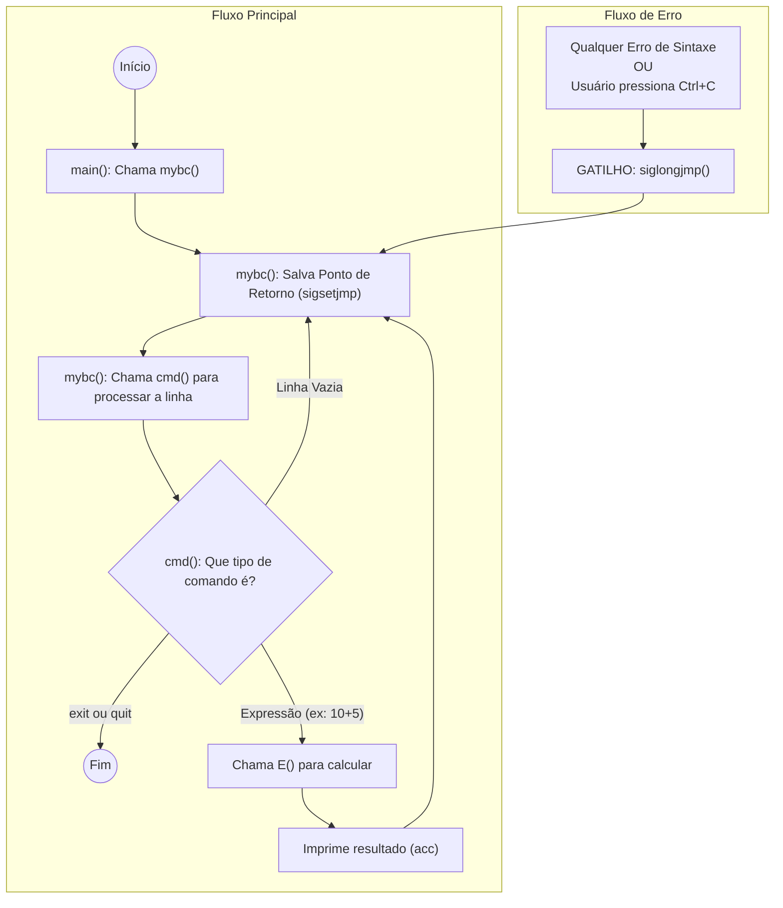

# mybc - Interpretador de Comandos Aritméticos

Interpretador interativo (REPL) de expressões aritméticas em C, desenvolvido como projeto de compiladores.

---

## 🏗️ Como Funciona o Código

### 1. Fluxo de Execução Principal



**Ciclo REPL:**
1. **Leitura** - Usuário digita uma expressão
2. **Análise Léxica** - Lexer converte caracteres em tokens
3. **Análise Sintática** - Parser processa tokens seguindo a gramática
4. **Avaliação** - Expressão é calculada em tempo real
5. **Impressão** - Resultado é exibido
6. **Loop** - Retorna ao passo 1

### 2. Componentes da Arquitetura

#### 📄 `main.c` - Ponto de Entrada
```c
int main(void) {
    lookahead = gettoken(source = stdin);  // Inicializa primeiro token
    mybc();                                 // Inicia o REPL
    return 0;
}
```

#### 🔤 `lexer.c` - Analisador Léxico (Scanner)

**Responsabilidades:**
- Lê caracteres da entrada
- Identifica padrões e gera tokens (ID, DEC, FLT, HEX, OCT, operadores)
- Mantém controle de linha e coluna para mensagens de erro
- Gerencia o lexema atual (string do token)

**Função Principal:** `int gettoken(FILE *source)`

**Tokens Reconhecidos:**
- Números: `DEC` (42), `FLT` (3.14), `HEX` (0x1A), `OCT` (075)
- Identificadores: `ID` (variáveis)
- Operadores: `+`, `-`, `*`, `/`, `(`, `)`
- Atribuição: `:=`
- Comandos: `exit`, `quit`
- Separadores: `;`, `\n`

#### 🌳 `parser.c` - Analisador Sintático + Interpretador

**Gramática Implementada:**
```
cmd   → E | exit | quit | ε
E     → T { (+|-) T }
T     → F { (*|/) F }
F     → (E) | NUM | ID [:= E]
```

**Funções Principais:**

1. **`void mybc(void)`** - Loop REPL com recuperação de erros
   - Configura handler para Ctrl+C
   - Processa comandos continuamente
   - Recupera de erros sem encerrar

2. **`void cmd(void)`** - Processa um comando
   - Identifica tipo de comando (expressão, exit/quit, ou vazio)
   - Chama `E()` para avaliar expressões
   - Imprime resultado

3. **`void E(void)`** - Avalia expressões (não-recursiva)
   - Implementa precedência de operadores usando pilha
   - Usa `goto` para loops internos (_Fbegin, _Tbegin)
   - Calcula resultado no acumulador `acc`
   - **Verifica divisão por zero** antes de executar divisões

4. **`void match(int expected)`** - Consome tokens
   - Verifica se token atual é o esperado
   - Avança para próximo token ou dispara erro

**Estruturas de Dados:**
- `double acc` - Acumulador (resultado intermediário)
- `double stack[1024]` - Pilha para operações
- `double vmem[4096]` - Memória virtual para variáveis
- `char symtab[4096][MAXIDLEN+1]` - Tabela de símbolos

### 3. Sistema de Recuperação de Erros

**Mecanismo: `setjmp`/`longjmp`**

```c
// Define ponto de recuperação
if (sigsetjmp(error_recovery, 1) != 0) {
    // Chegou aqui após um erro
    // Descarta tokens até próxima linha
    while(lookahead != '\n' && lookahead != ';' && lookahead != EOF) {
        lookahead = gettoken(source);
    }
    continue; // Volta ao loop principal
}
```

**Quando ocorre erro:**
1. Função `siglongjmp(error_recovery, 1)` é chamada
2. Execução salta para o ponto marcado no loop principal
3. Tokens são descartados até próximo separador (`;` ou `\n`)
4. Loop continua normalmente

**Tipos de Erros Tratados:**
- ✅ Erros de sintaxe (token inesperado)
- ✅ Divisão por zero (erro de runtime)
- ✅ Ctrl+C (interrupção de usuário)

---

## ✨ Funcionalidades

- ✅ **Operações aritméticas:** `+`, `-`, `*`, `/`
- ✅ **Parênteses** e precedência de operadores
- ✅ **Números:** inteiros, decimais, hexadecimais (0x), octais (0)
- ✅ **Variáveis:** atribuição com `:=`
- ✅ **Divisão por zero:** detectada e reportada
- ✅ **Recuperação de erros:** interpretador continua após erros
- ✅ **Mensagens detalhadas:** linha, coluna e tipo de erro
- ✅ **Captura de Ctrl+C:** não encerra o interpretador
- ✅ **REPL completo:** Read-Eval-Print-Loop interativo

---

## 🚀 Compilação e Execução

```bash
make          # Compila o projeto
./mybc        # Executa o interpretador
```

## 📖 Exemplos de Uso

```bash
$ ./mybc
2+3
5
x := 10
10
x * 2
20
(5+3)*4
32
10/0
Runtime Error at line 8:
  Division by zero
exit
$
```

---

## 🧪 Testes

### Validação Automatizada (32 testes)
```bash
./test_auto.sh
```

### Suite Completa de Demonstração
```bash
./test_all.sh
```

Ver documentação completa em **[TESTES.md](TESTES.md)**

---

## 🎯 Características Implementadas

### 1. Recuperação de Erros
O interpretador **não encerra** após erros:
```bash
$ ./mybc
2+3
5
2 + * 3
Syntax Error at line 3, column 5:
  Expected: ID
  Found: * ('*')
4+4
8
```

### 2. Divisão por Zero
Detecta e reporta divisão por zero em runtime:
```bash
$ ./mybc
10/0
Runtime Error at line 2:
  Division by zero
5/2
2.5
```

### 3. Contagem de Linhas Interativa
Números de linha refletem o que você vê no terminal (incluindo outputs):
```bash
Linha 1: 2+3      (input)
Linha 2: 5        (output)
Linha 3: 2 + * 3  (input - erro aqui)
         ↑
Error at line 3
```

### 4. Captura de Ctrl+C
Pressionar Ctrl+C imprime uma quebra de linha e **continua** o interpretador.

---

## 📦 Estrutura do Projeto

```
mybc/
├── lexer.c, lexer.h      # Analisador léxico (tokenização)
├── parser.c, parser.h    # Parser + interpretador (avaliação)
├── tokens.h              # Definições de tokens
├── main.c, main.h        # Entrada do programa (REPL)
├── Makefile              # Compilação
├── test_auto.sh          # 32 testes automatizados
├── test_all.sh           # Demonstração completa
├── test_checklist.sh     # Checklist manual
├── TESTES.md             # Documentação de testes
└── README.md             # Este arquivo
```

---

## 📚 Documentação

- **[TESTES.md](TESTES.md)** - Guia completo de testes
- **[CTRL_C_EXPLAINED.md](CTRL_C_EXPLAINED.md)** - Explicação do tratamento de Ctrl+C

---

## ✅ Status

**32/32 testes automatizados passando** ✅

```bash
$ ./test_auto.sh
🎉 TODOS OS TESTES PASSARAM!
```